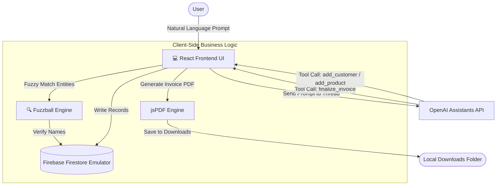

# AI Invoice Agent (AI Stock Manager)

The AI Invoice Agent is an intelligent business automation system designed to handle inventory management, customer profiling, and invoice-related tasks through natural language interaction.

Rather than manually searching through databases, writing SQL queries, or making administrative requests to finance and warehouse teams, users can interact with the system using plain-English prompts such as:
* *“Generate an invoice for OK Zimbabwe containing 5 cases of Coca Cola and 3 cases of Mazoe Orange Crush”*
* *“I would like to add a new customer called ABC Trading registered at 45 Leopold Takawira, Harare”*
* *“Please add a new product called Fanta with a price of $110 per case, 24 units per case, and 500ml volume”*

The AI parses the request, executes local business logic via tool/function calling, cross-checks and fuzzy-matches entities, writes to the local database, and generates structured PDF invoices ready for download.

---

## Architecture & Interaction Flow

The system employs a client-side AI integration model where the React application communicates directly with the OpenAI Assistants API (utilizing `gpt-4o-mini` and the Thread run lifecycle) and interfaces with a local database via Firebase Local Emulators.



---

## Core Capabilities

### 1. Natural Language Understanding & Conversational Flow
* Interprets complex multi-step user prompts in plain English.
* Maintains thread context for back-and-forth confirmation dialogues (e.g., confirming fuzzy matches).
* Operates as an automated conversational clerk.

### 2. Fuzzy Entity Resolution
* Powered by `fuzzball`, the agent handles spelling mistakes and abbreviations in user requests (e.g., matching *"OK Zim"* to *"OK Zimbabwe Ltd"* or *"coke"* to *"Coca Cola"*).
* If a match falls below an exact match but above a confidence threshold, the agent will prompt the user with a confirmation query (e.g., *"Did you mean 'OK Zimbabwe Ltd' instead of 'OK Zim'?"*) to avoid database corruption.

### 3. Automated PDF Invoice Generation
* Implemented client-side using `jsPDF` and `jspdf-autotable`.
* Calculates subtotal, applies Zimbabwean VAT rules (13.04% rate), and computes the total invoice amount.
* Outputs a professional, production-ready invoice PDF detailing billing information, line items, and company banking/contact info, saving it directly to the user's browser `Downloads` folder.

### 4. Database Ingestion & Verification
* Verifies inventory availability, prices, and customer accounts before processing orders.
* Empowers users to create new customer accounts and product records inline via conversational commands.

### 5. Multi-View Dashboard Interface
* **AI Assistant**: A sleek chat screen featuring interactive sample templates, typing indicators, and message history.
* **Inventory**: Live stock level tables with filtering options and CSV/PDF export.
* **Customers**: Profile overview outlining contact numbers, emails, addresses, credit levels, and payment statuses (Good/Overdue).
* **Place Order**: A visual transaction manager displaying purchase histories, payment statuses, and transaction volumes.
* **Stats**: Interactive charts (Sales Trends, Stock Levels, Category Breakdowns) powered by `chart.js`.

---

## Tech Stack

| Layer | Technology | Purpose |
| :--- | :--- | :--- |
| **Frontend** | React (v19) | Application structure and reactive UI components. |
| **Component Library** | Material UI (MUI v6) | Pre-styled, polished inputs, drawers, modals, and grids. |
| **Aesthetics** | Glassmorphic CSS | Modern visual design featuring backdrop filters, glowing blurs, and transparent dark panels. |
| **AI Orchestration** | OpenAI Assistants API | Core conversational logic, schema-strict function calling. |
| **Database & Auth** | Firebase (Firestore + Auth) | Persistent document store and auth emulator layers. |
| **Fuzzy Matching** | Fuzzball | Similarity scoring and validation of customer/product names. |
| **PDF Processing** | jsPDF & jsPDF-AutoTable | Client-side dynamic PDF compilation and download management. |
| **Data Analytics** | Chart.js & React-Chartjs-2 | Visual telemetry for inventory breakdowns and sales trends. |

---

## Workspace Folder Structure

```filepath
AI-invoice-agent-main/
├── functions/                     # Firebase Functions environment (Node.js)
│   ├── index.js                   # Entry point for backend functions (currently clean)
│   └── package.json               # Functions-specific dependencies
├── public/                        # Static assets & HTML template wrapper
└── src/
    ├── assets/                    # Background graphics and company branding images
    ├── components/                # Modular UI components
    │   ├── AIAssistantScreen/     # Chats history viewer and message input
    │   ├── CustomersScreen/       # Add customer form modals
    │   ├── InventoryScreen/       # Table structures and filtering headers
    │   ├── PlaceOrderScreen/      # Order creation interfaces
    │   ├── StatsScreen/           # Chart.js visualization wrappers
    │   ├── Header.js              # Global system top bar
    │   └── SideDrawer.js          # Main navigation bar (Drawer layout)
    ├── config/
    │   └── firebaseConfig.js      # App configuration pointing to Local Emulators
    ├── context/                   # React Context Providers (State & Core Actions)
    │   ├── AppContext.js          # Global loading states and error boundaries
    │   ├── CustomersContext.js    # Firestore integration for customer metadata
    │   ├── InventoryContext.js    # Firestore integration for product listings
    │   └── OrdersContext.js       # Core logic: Assistant run loops, fuzzy matching, and PDF generation
    ├── screens/                   # High-level route views
    │   ├── AIAssistantScreen.js   # Chat interface main frame
    │   ├── CustomersScreen.js     # Customer management screen
    │   ├── InventoryScreen.js     # Stock manager panel
    │   ├── PlaceOrderScreen.js    # Manual order placing & billing panel
    │   └── StatsScreen.js         # Analytics and visual stats panel
    ├── App.css                    # Global application styles
    ├── App.js                     # Root component declaring Context Providers & Router
    ├── index.css                  # Core Glassmorphic design system and utility classes
    └── index.js                   # Application bootstrap
```

---

## Installation & Setup

### 1. Prerequisites
Ensure you have the following installed on your developer machine:
* Node.js (v18 or higher recommended)
* Firebase CLI (for running emulators)
* An OpenAI API Key (with access to Assistant APIs)

### 2. Clone and Setup Environment
Navigate into the inner project directory:
```bash
cd AI-invoice-agent-main/AI-invoice-agent-main
```

Create a `.env` file in the root of the project directory and configure your OpenAI API Key:
```env
REACT_APP_OPENAI_API_KEY="your-openai-api-key-here"
```

### 3. Install Dependencies
Install all client dependencies:
```bash
npm install
```

### 4. Boot Up Firebase Local Emulators
The application is pre-configured to read and write to Firestore and Auth through the local emulator suite to keep development sandbox-safe.
Start the emulators:
```bash
firebase emulators:start
```
*Note: Make sure your Firestore emulator is running on port `8080` and the Auth emulator on port `9099` (as defined in firebaseConfig.js).*

### 5. Launch the React Client
Open a separate terminal window and run:
```bash
npm start
```
Your browser should open automatically to `http://localhost:3000`.

---

## OpenAI Assistant Function Configurations

The application creates/calls an OpenAI Assistant using the following strict function schemas:

### 1. `finalize_invoice`
Registers the invoice details after fuzzy entity validation:
```json
{
  "name": "finalize_invoice",
  "description": "Finalizes the invoice with complete data",
  "parameters": {
    "type": "object",
    "properties": {
      "customerName": { "type": "string" },
      "items": {
        "type": "array",
        "items": {
          "type": "object",
          "properties": {
            "productName": { "type": "string" },
            "quantity": { "type": "number" }
          },
          "required": ["productName", "quantity"]
        }
      },
      "date": { "type": "string", "description": "Date in YYYY-MM-DD format" }
    },
    "required": ["customerName", "items", "date"]
  }
}
```

### 2. `add_customer`
Saves a new customer to the database:
```json
{
  "name": "add_customer",
  "description": "Adds a new customer to the database",
  "parameters": {
    "type": "object",
    "properties": {
      "tradeName": { "type": "string" },
      "registeredName": { "type": "string" },
      "vatNumber": { "type": "string" },
      "tinNumber": { "type": "string" },
      "email": { "type": "string" },
      "phone": { "type": "string" },
      "address": { "type": "string" }
    },
    "required": ["tradeName", "registeredName", "vatNumber", "tinNumber", "email", "phone", "address"]
  }
}
```

### 3. `add_product`
Saves a new product to the database:
```json
{
  "name": "add_product",
  "description": "Adds a new product to the database",
  "parameters": {
    "type": "object",
    "properties": {
      "name": { "type": "string" },
      "pricePerCase": { "type": "number" },
      "unitsPerCase": { "type": "number" },
      "volume": { "type": "number" }
    },
    "required": ["name", "pricePerCase", "unitsPerCase", "volume"]
  }
}
```

---

## Business Problem Solved
1. **Zero Admin Wait Time**: Operations managers can issue invoices on the spot in front of clients using simple messaging, without waiting for the accounting desk.
2. **Reduced Human Error**: Standardizes unit calculations, subtotaling, VAT formulas, and formats professional invoices in standard PDFs.
3. **Database Integrity**: Blocks duplicate or incorrect entries through automatic fuzzy verification.
4. **Instant Self-Service Data**: Simplifies complex database searching down to a simple question: *"What is the status of our latest inventory?"*

---

## Why This Project Is Strong
* **Real-World Agentic Workflow**: Showcases true tool calling and execution loops where the LLM behaves as a reasoning controller, returning structured parameters for client execution.
* **Sandbox-First Localized Architecture**: Includes fully configured rules and configuration variables for running Firebase services completely offline under Local Emulators.
* **Beautiful User Experience**: Incorporates dynamic animations, glassmorphic headers, visual layouts, and dark panels that exceed average administrative portals.
